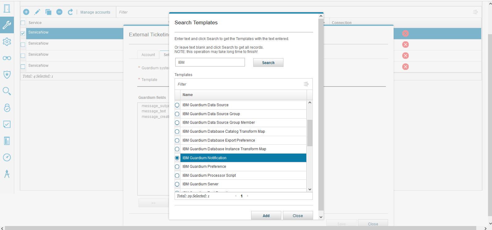

# IBM Guardium Notification Consumer app in ServiceNow

## Installation Instructions

### Install latest ServiceNow **Update Set** onto your developer instance

- Download the latest [XML Update Set in GitHub](https://github.com/IBM/ServiceNow-Guardium-Notification-Consumer/blob/main/Update-Sets)
- Login to your ServiceNow developer instance
- Navigate to System Update Sets > Retrieved Update Sets > Import Update Set from XML
- Browse > Select the "Update Set" XML file > Upload
- Click on the "IBM Guardium" label
- Click "Preview Update Set"
- Click "Commit Update Set"
- Click "Close"
- Verify that the IBM Guardium menu has been added to the Navigation Menu by typing "Guardium" in the navigation menu

## IBM Guardium Data Protection

### Change "External Ticketing" Configuration

- Go to `Setup > Tools and Views > External Ticketing System`
- Fill in account information for the ServiceNow URL, **ServiceNow user name** with *at least* roles of `x_ibmrt_gdpcon.producer` and `personalize_decision_table_input`, and the ServiceNow user password

- Change the Alerter, Risk Spotter, and Threat Analytics to use the template (ServiceNow table) provided by this plug-in:  **IBM Guardium Notification** (`x_ibmrt_gdpcon_notification`)

- Notice in the diagram below that I have simplified the alert notification so that it is easier to parse in the example script code provided with this ServiceNow plug-in

- It is safe to delete the **Vulnerability Assessment** configuration if you are using the [**IBM Guardium Vulnerability Assessment**](https://github.com/IBM/ServiceNow-Guardium-Vulnerability-Assessment/) plug-in available on the ServiceNow Store to synchronize test results

## Final Word

IBM Guardium Data Protection will now create notifications in ServiceNow. The alert is probably easiest to test.  Go to **Alert Builder** in IBM Guardium Data Protection to configure the **Alert Receiver** and set the **Notification Type** to **TICKET**.  Many of the alerts have a default run frequency of once per day which means, by default, you will have to wait a day before you see any new notification in ServiceNow.  You can change that run frequency if you desire.

