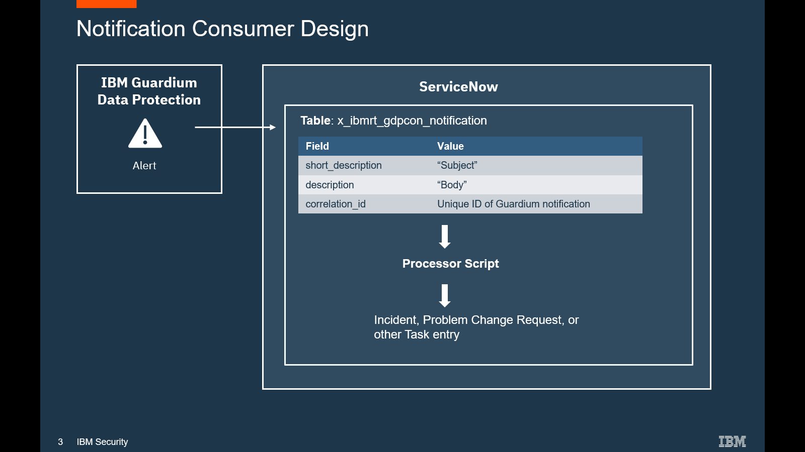

  
<b>Table of contents</b>

  - [Overview](#overview)
  - [Requirements](#requirements)
  - [Technical Documentation](#technical-documentation)
  - [Design Diagram](#design)
  - [Licensing](#licensing)
  - [Contributing](CONTRIBUTING.md)
  - [Contact us](issues)

# IBM Guardium Notification Consumer in ServiceNow

## Requirements

### IBM Guardium
- IBM Guardium 11.3 or greater

### ServiceNow
- ServiceNow Rome (or better) release
- This plug-in
- A ServiceNow user with roles: 

  | Role name | Comments |
  | :---      | :--- |
  | x_ibmrt_gdpcon.producer | Necessary to save a notification to ServiceNow |
  | personalize_decision_table_input | Necessary to read a list of tables in ServiceNow |

### Install This Plug-in
- You can install this plug-in in one of two ways:
  1. Import from source control (this entire github project)
  2. Update Set: follow instructions in <a href="../INSTALLATION.md">Installation document</a>

## Technical Documentation

- <a href="../INSTALLATION.md">Read-me for installation instructions</a>
- <a href="../DEVELOPMENT.md">Read-me for developers</a>
- <a href="../DESIGN-DOC.md">Read-me for technical design documentation</a>

## Design

## Licensing

[Project License](../LICENSE)

Licensed under the Apache License, Version 2.0 (the "License");
you may not use this file except in compliance with the License.
You may obtain a copy of the License at

    http://www.apache.org/licenses/LICENSE-2.0

Unless required by applicable law or agreed to in writing, software
distributed under the License is distributed on an "AS IS" BASIS,
WITHOUT WARRANTIES OR CONDITIONS OF ANY KIND, either express or implied.
See the License for the specific language governing permissions and
limitations under the License.
